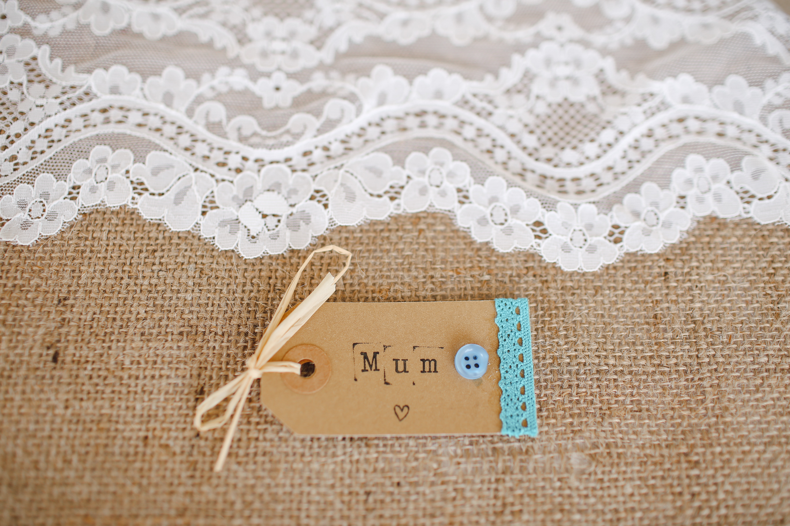
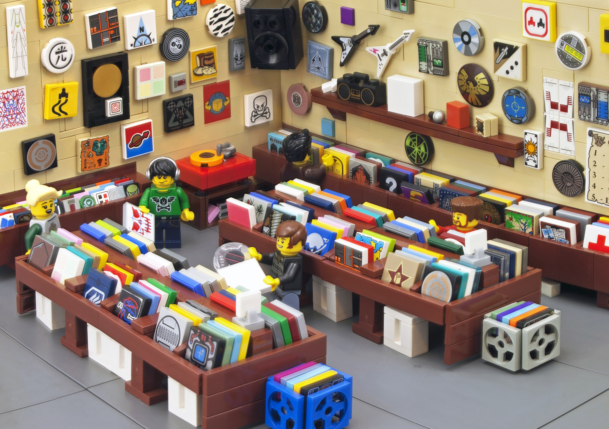

```{r setup, include=FALSE}
options(htmltools.dir.version = FALSE)
knitr::opts_chunk$set(collapse = TRUE,
                      fig.retina = 3)

library(ymlthis)
library(tidyverse)
library(xaringanExtra)
xaringanExtra::use_xaringan_extra(include = c("panelset", "tile_view", "share_again"))
xaringanExtra::use_share_again()
xaringanExtra::style_share_again(
  share_buttons = c("twitter", "linkedin", "pocket")
)
```

```{r meta, echo=FALSE}
library(metathis)
meta() %>%
  meta_general(
    description = "MySQL",
    generator = "xaringan and remark.js"
  ) %>% 
  meta_name("github-repo" = "sciencificity") %>% 
  meta_social(
    title = "Accessing a MySQL DB in R",
    url = "https://...",
    image = "images/fran-hogan-gMca5DJ25Qo-unsplash.jpg",
    image_alt = "painting unsplash",
    og_type = "website",
    twitter_card_type = "summary_large_image"
  )
```


class: title-slide, left, middle

# `r rmarkdown::metadata$title`

## `r rmarkdown::metadata$subtitle`

### `r rmarkdown::metadata$author`

---

name: clouds
background-image: url(images/clouds.jpg)
background-size: cover
class: middle, center

```{css, echo=FALSE}
.panelset {
  --panel-tab-font-family: Work Sans;
  --panel-tab-background-color-active: #fffbe0;
  --panel-tab-border-color-active: #023d4d;
}

.panelset .panel-tabs .panel-tab > a {
	color: #023d4d;
}
```


# Who am I?

.column[
<h3>I'm a nerd, <br>and an R nerd at that<h3>

]

.column[
<h3>I co-organise R-Ladies Johannesburg<h3>

]

.column[
<h3>I'm a mum ...<h3>

]

.column[
<h3>... which results in far-out journeys<h3>

]

---

name: clouds
background-image: url(images/clouds.jpg)
background-size: cover
class: middle, center


# Who are you?

<div class="flex" style="margin: 0 1em;">
  <div class="column">
    <h3> You've got data in a database <h3>
    
  </div>
  
???

--

   <div class="column"style="margin: 0 1em;">
    <h3> You know enough of the tidyverse </h3>
    
  </div>
  

???

You have good tidyverse knowledge...most especially dplyr.


--

   <div class="column"style="margin: 0 1em;">
    <h3> You want to flex that skill </h3>
    
  </div>
  

???

You want to leverage that knowledge and connect directly to your database

--

   <div class="column"style="margin: 0 1em;">
    <h3> Lighter cognitive load </h3> <br> <br>
    
  </div>
  

???

It's hard switching context between SQL and R tidyverse. While it is good to know both sometimes in an analysis you'd like to have a lower cognitive load.


---

```{css echo=FALSE}
.show-only-last-code-result pre + pre:not(:last-of-type) code[class="remark-code"] {
    display: none;
}
```

## Quick Knowledge Check

.panelset[
.panel[.panel-name[Explain this]

Do you understand what this piece of code is doing? Will you discuss with your neighbour for a minute, and make a choice on the next tab.

```{r eval=FALSE}
palmerpenguins::penguins %>% 
  select(species, sex, flipper_length_mm) %>%
  drop_na() %>% 
  group_by(species, sex) %>% 
  summarise(avg_flipper_len = mean(flipper_length_mm))
```
]

  <div class="panel">
    <div class="panel-name">Options</div>
    <ol>
    <li><p>Returns only the average flipper length of each <code>species</code>.</p></li>
    <li><p>Returns the entire dataset, with the average flipper length<br>
      of the <code>species</code>, tagged on as new column.</p></li>
    <li><p> It returns the average flipper length split by <code>species</code> and <code>sex</code>. 
      Only observations which have values for species, sex and flipper_length_mm are included.</p></li>
    <li><p>It gives an error because it should be summari<strong>z</strong>e() not summari<strong>s</strong>e().</p></li>
    </ol>
  </div>

.panel[.panel-name[Solution]

.left-code[
The answer is `c`.

```{r increment, eval=FALSE}
palmerpenguins::penguins %>% 
  select(species, sex, 
         flipper_length_mm) %>%
  drop_na() %>% 
  group_by(species, sex) %>% 
  summarise(avg_flipper_len =
      mean(flipper_length_mm))
  
```
]

.right-out[

```{r increment-out, ref.label='increment', echo=FALSE}

```

]

]
]

---
### Connecting to a Database

.panelset[
.panel[.panel-name[Overall]

- Install the `DBI` package.
- The `DBI` package is a __D__ata__Base__ __I__nterface for R.
- Install the `odbc` package.
- The `odbc` package is a DBI compliant interface to __O__pen __D__ata__B__ase __C__onnectivity (ODBC) drivers.
- Install the `dbplyr` package which is a dplyr back-end for databases.

```{r eval=FALSE}
install.packages("DBI")
install.packages("odbc")
install.packages("dbplyr")
```
]

.panel[.panel-name[Using an DBI-compliant R `r emo::ji("package")`]

- Install the DBI-compliant R `r emo::ji("package")`
- We'll use the `RMariaDB` `r emo::ji("package")` as an example here (similar process for `RPostgres` etc.).
- [MariaDB](https://www.guru99.com/mariadb-vs-mysql.html) is an improved version
of MySQL.

.tiny[
```{r eval=FALSE}
install.packages("RMariaDB")
```
]
- We make a __connection__ to the DB, using `dbConnect()`, providing these arguments: 
  
  * `drv`: The driver we're using, here `RMariaDB::MariaDB()`.
  * A path to the DB - in the example scripts this is `localhost`.
  * Other info such as user name, password, port. 

.tiny[
```{r, eval = FALSE}
con <- dbConnect(drv = RMariaDB::MariaDB(), # driver we're using
    dbname = "DB_name", 
    host = "URL_or_localhost",
    user = "user_name", 
    password = "pswd",
    port = "3306" # common port for MySQL, but check with DBA
)
```
]
]

.panel[.panel-name[Using an odbc driver]

- You can download the ODBC driver from your database vendor's website.
- List the drivers you have available using `odbcListDrivers()`.

.tiny[
```{r eval=FALSE}
library(odbc)
sort(unique(odbcListDrivers()[[1]]))
```
]

- We make a __connection__ to the DB, using `dbConnect()` as before, this time through the applicable `odbc` driver. 

.tiny[
```{r, eval = FALSE}
con <- dbConnect(
    odbc::odbc(),
    Driver = "e.g.MySQL ODBC 8.0 Unicode Driver",
    Database = "DB_name",
    Server = "URL_or_localhost",
    UID = "user_name",
    PWD = "pswd",
    port = "3306"
)
```
]
]
]

---

### We're connected, now what?

.panelset[
.panel[.panel-name[Have a look around]

.pull-left[
- Write data into a database table
<br> <br> <br> <br> <br>
- List all tables
<br> <br> <br> <br> <br>
- List the fields in a particular table
<br> <br> <br> <br> <br>
]
.pull-right[
.tiny[
```{r eval=FALSE}
dbWriteTable(con, # using connection con
    "mtcars", # write into a table "mtcars"
     mtcars, # the dataset mtcars
     overwrite = TRUE # overwrite the data there if it exists
     )
```
]

.tiny[
```{r eval=FALSE}
dbListTables(con)
## [1] "mtcars"
```
]

.tiny[
```{r eval=FALSE}
dbListFields(con, "mtcars")
##  [1] "mpg"  "cyl"  "disp" "hp"   "drat" 
# "wt"   "qsec" "vs"   "am"   "gear"
## [11] "carb"
```
]
]

]

.panel[.panel-name[Use `dplyr` pipelines]

.pull-left[
- Connect to table <span style="color: #008080;background-color:#9FDDBA">tbl(con, "tbl_name")</span> 

- Select subsets of data
<br> <br> <br> <br>
- Anayse data
<br> <br> <br> <br> <br> <br>
- Filter data
<br> <br>
]
.pull-right[
.tiny[
```{r connect1, eval=FALSE}
tbl(con, # using our connection
    'mtcars' # reach into the mtcars table
    ) %>% 
  select(cyl) %>%  distinct()
# Source:   lazy query [?? x 1]
# Database: sqlite 3.33.0 [:memory:]
#     cyl
# 1     6 ...
```
]

.tiny[
```{r eval=FALSE}
tbl(con, "mtcars") %>% 
  count(cyl) 
#     cyl     n
#   <dbl> <int>
# 1     4    11
# 2     6     7 ...
```
]

.tiny[
```{r eval=FALSE}
tbl(con, "mtcars") %>% 
  filter(am == 0) 
```
]
]

]

.panel[.panel-name[More `dplyr`]

.pull-left[
- Join tables from your database <span style="color: #FFE4E1;background-color:#FD5800">NOTE: tbl(con, "tbl_name1") and tbl(con, "tbl_name2")</span>. 

<br> <br> 
- What's the SQL Looking like?
<br> <br> <br> <br> 
]
.pull-right[
.tiny[
```{r, eval=FALSE}
tbl(con, "tbl_name1") %>% 
  left_join(tbl(con, "tbl_name2"),
      by = c("col1" = "name_1",
             "coln" = "name_n")
```
]

.tiny[
```{r eval=FALSE}
tbl(con, "mtcars") %>% 
  count(cyl) %>% 
  show_query()
# <SQL>
# SELECT `cyl`, COUNT(*) AS `n`
# FROM `mtcars`
# GROUP BY `cyl`
```
]

]

]

]

---

### Always remember to ... 

- Collect your data only when you need to (close to the end).

```{r, eval = FALSE}
my_db_mtcars <- tbl(con, "mtcars") %>% 
  count(cyl) %>% 
  collect() # finally bringing data into R
```

- Disconnect when you're done!

```{r, eval = FALSE}
dbDisconnect(con)
```

---
### Let's take stock

If I told you I want to:

 * Create a SQLite

.panelset[
.panel[.panel-name[Unscramble this]

1. dbWriteTable(con, "band_members", dplyr::band_members)
1. library(DBI)
1. dbListFields(con, "band_members")
1. dbDisconnect(con)
1. con <- dbConnect(RSQLite::SQLite(), ":memory:")
1. tbl(con, "band_members")

]

.panel[.panel-name[Solution]
.pull-left[
2: library(DBI) <br>
5: con <- dbConnect(RSQLite::SQLite(), ":memory:")<br>
1: dbWriteTable(con, "band_members", dplyr::band_members)<br>
3: dbListFields(con, "band_members")<br>
6: tbl(con, "band_members")<br>
4: dbDisconnect(con)
]

.pull-right[
.tiny[
```{r}
library(DBI)
con <- dbConnect(RSQLite::SQLite(), ":memory:")
dbWriteTable(con, "band_members", dplyr::band_members)
dbListFields(con, "band_members")
tbl(con, "band_members")
dbDisconnect(con)
```
]
]
]

]

---
background-image: url(images/neven-krcmarek-0TH1H1rq_eY-unsplash.jpg)
background-position: 1000px 20px
background-size: 200px 100px

### Our dataset

.panelset[
.panel[.panel-name[The Great British Bake off]

Alison Hill has put together some data from the Great British Bake off [here](https://github.com/apreshill/bakeoff).

I converted it to a SQLite DB that we can use to practise our skills on.

.pull-left[
.tiny[
```{r, echo = FALSE, warning = FALSE, message = FALSE, eval = TRUE}
library(DBI)
library(tidyverse)  
library(dbplyr)    
con <- dbConnect(
    drv = RSQLite::SQLite(),
    dbname = "great_brit_bakeoff.db"
)
```

```{r, eval = TRUE}
tbl(con, "baker_results") %>% 
  select(series, baker,
    star_baker:technical_top3) %>% 
  head(3)
```
]
]

.pull-right[
.tiny[
```{r, eval = TRUE}
tbl(con, "results") %>% 
  select(series, baker, result) %>% 
  filter(result == "WINNER") %>% 
  head(3)
```
]
]
]

.panel[.panel-name[Create a connection]

.pull-left[

- It is a SQLite DB in your working directory.
- It is named `great_brit_bakeoff.db`

Which code will make the connection?

a.

.tiny[
```{r, echo = TRUE, eval = FALSE}
library(DBI)
con <- dbConnect(
    drv = RSQLite::SQLite(),
    dbname = "great_brit_bakeoff.db"
)
```
]

]
.pull-right[

b. 

.tiny[
```{r, echo = TRUE, eval = FALSE}
library(DBI)
con <- dbConnect(
    drv = RSQLite::SQLite(),
    user = "admin", password = "password",
    dbname = "great_brit_bakeoff.db"
)
```
]

c. 

.tiny[
```{r, echo = TRUE, eval = FALSE}
library(DBI)
con <- dbConnect(
    drv = RPostgres::Postgres(), host = "localhost",
    user = "admin", password = "password",
    dbname = "great_brit_bakeoff.db"
)
```
]
]

]

.panel[.panel-name[Your Turn]

Open up `exercise-01.Rmd` and:

1. Complete the connection code.
1. Recalling that we are joining the `baker_results` and the `results` tables, complete the join code.
1. Amend `eval = FALSE` in the __setup__ code chunk to `eval = TRUE`.
1. Knit the document.
1. Interested in a different __winner__? Fill in the code to view how your baker performed across the season.


]

]

---

background-image: url(images/faria-anzum-ONK9IlKizS4-unsplash.jpg)
background-position: right
background-size: 300px 400px

## Acknowledgements 

#### Slides inspired by Dr. Alison Hill 
[Teaching in Production](https://rstudio-education.github.io/teaching-in-production/)

#### Yihui Xie's and Garrick Aden-Buie's excellent
[xaringan](https://github.com/yihui/xaringan) `r emo::ji("package")`  [xaringanExtra](https://github.com/gadenbuie/xaringanExtra) `r emo::ji("package")`

#### Pictures
There are several pictures used from [Unsplash](https://unsplash.com/)

<!-- <span>Photo by <a href="https://unsplash.com/@simplicity?utm_source=unsplash&amp;utm_medium=referral&amp;utm_content=creditCopyText">Marija Zaric</a> on <a href="https://unsplash.com/s/photos/star-wars?utm_source=unsplash&amp;utm_medium=referral&amp;utm_content=creditCopyText">Unsplash</a></span> -->
<!-- <span>Photo by <a href="https://unsplash.com/@helloimnik?utm_source=unsplash&amp;utm_medium=referral&amp;utm_content=creditCopyText">Hello I'm Nik 🎞</a> on <a href="https://unsplash.com/s/photos/star-wars?utm_source=unsplash&amp;utm_medium=referral&amp;utm_content=creditCopyText">Unsplash</a></span> -->
<!-- <span>Photo by <a href="https://unsplash.com/@hermez777?utm_source=unsplash&amp;utm_medium=referral&amp;utm_content=creditCopyText">Hermes Rivera</a> on <a href="https://unsplash.com/s/photos/star-wars?utm_source=unsplash&amp;utm_medium=referral&amp;utm_content=creditCopyText">Unsplash</a></span> -->
<!-- <span>Photo by <a href="https://unsplash.com/@freestocks?utm_source=unsplash&amp;utm_medium=referral&amp;utm_content=creditCopyText">freestocks</a> on <a href="https://unsplash.com/s/photos/star-wars?utm_source=unsplash&amp;utm_medium=referral&amp;utm_content=creditCopyText">Unsplash</a></span> -->

---
background-image: url(images/markus-spiske-8CWoXxaqGrs-unsplash.jpg)
background-position: 800px 20px
background-size: 300px 200px

## More Resources

#### Looking for more practise

Check out:

1. [Databases using R](https://db.rstudio.com/) `r emo::ji("tada")` `r emo::ji("heart")`.
1. I have a package called [reclues](https://github.com/sciencificity/reclues) which contains a database which mimics the SQL Murder Mystery done by [Northwestern’s Knight Lab](https://github.com/NUKnightLab/sql-mysteries). The `r emo::ji("package")` [site is here](https://sciencificity.github.io/reclues/).

1. I included the SQL Create scripts in the scripts folder - you can make a PostgreSQL version of `The Great British Bake Off` data to practise on `r emo::ji("happy")` `r emo::ji("dessert")`.


---

name: goodbye
class: right, middle
background-image: url(images/nathan-dumlao-KMEqlxz3mKc-unsplash.jpg)
background-size: cover


# Thank you!

